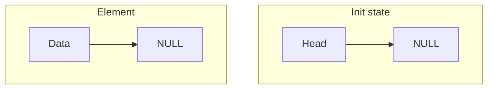
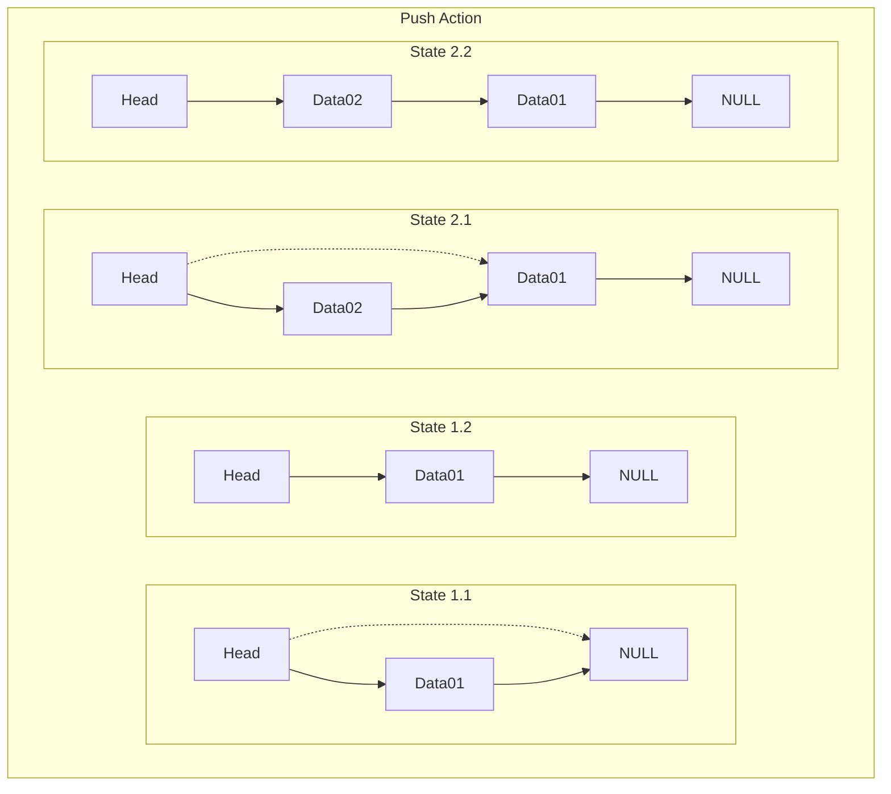
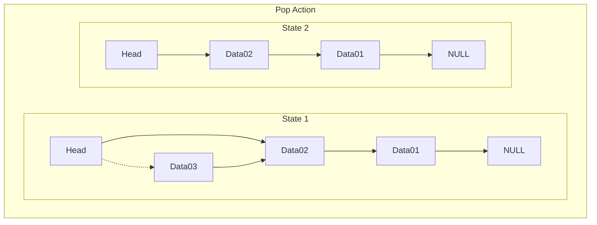
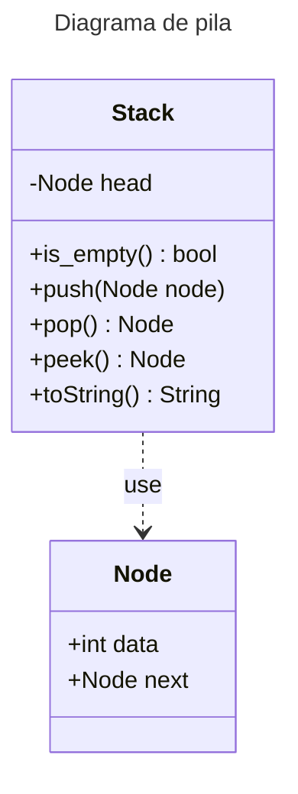

# Stack

- [Definición](#definición)
- [Static](#static)
- [Dynamic](#dynamic)
  - [Acción Push](#push-action)
  - [Acción Pop](#pop-action)
- [Diarama a clases](#diagrama-de-clases)

## Definición

Una pila (stack) es una estructura de datos de tipo FILO (first-in, last-out) o LIFO (last-in, first-out) dónde sus operaciones se asemejan a los de una pila de papeles; Podemos agregar nuevos elementos al inicio de la pila y remover los elementos desde el inicio de la misma. La pila tiene dos operaciones que lo caracterizan:

- `push`: Agrega un nuevo elemento en el tope o inicio de la pila.
- `pop`: Elimina el elemento del tope de la pila y lo retorna.

Otro de los metodos que se pueden encontrar dentro de una pila son:

- `is_empty`: Pregunta si la pila está vacía.
- `is_full`: Pregunta si la pila está llena.
- `top` o `peek`: Muestra el elemento en el tope de la pila.

## Static

## Dynamic

### Push Action

### Pop Action

## Diagrama de clases

